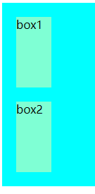
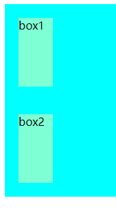
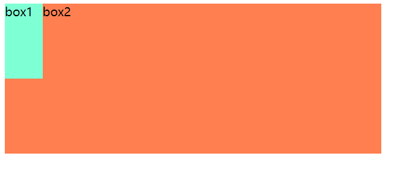
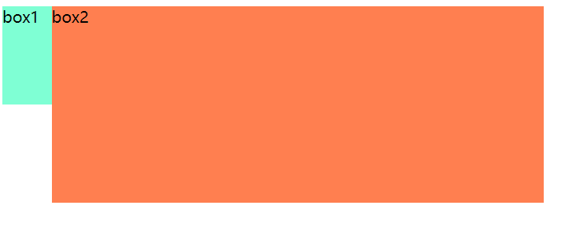
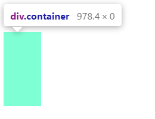
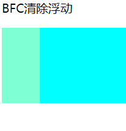

# BFC的理解

## BFC的基本概念

`BFC`是块级格式化上下文，它是页面的一块渲染区域，并且有一套自己的渲染规则。

* `BFC`内部的盒子会在垂直方向上一个个排列布局。
* 同一个`BFC`内部的盒子的`margin`会发生重叠，与方向无关。
* 每个元素的左外边距与包含块的左边界相接触（从左到右），即使浮动元素也是如此。
* `BFC`的区域不会与浮动区域重叠。
* 计算`BFC`的高度时，浮动子元素也参与计算。
* `BFC`就是页面上的一个隔离的独立容器，容器里面的子元素不会影响到外面的元素，反之亦然。

## BFC的触发条件

触发`BFC`的条件

* 根元素，`html`元素。
* 浮动元素，即`float`值为`left`、`right`。
* `overflow`值不为 `visible`，为 `auto`、`scroll`、`hidden`。
* `display`的值为`inline-block`、`inltable-cell`、`table-caption`、`table`、`inline-table`、`flex`、`inline-flex`、`grid`、`inline-grid`。
* `position`的值为`absolute`或`fixed`。

## BFC的作用

### ① 导致外边距折叠问题

 外边距折叠（Margin collapsing）也只会发生在属于同一`BFC`的块级元素之间。 

**HTML**

~~~html

    

    

~~~

**css**

~~~css
.container {
    background-color: aqua;
    overflow: hidden;
  }
  .box2 {
    background-color: aquamarine;
    height: 100px;
    width: 50px;
    margin: 20px;
  }
~~~

box1元素与box2元素当前处于统一`BFC`下面，会导致外边距折叠。

解决办法：**创建一个新的`BFC`**。

### ② 制作两栏布局

`BFC`的区域不会与浮动的区域重叠。

**HTML**

~~~html

    box1

    box2

~~~

**CSS**

~~~css
.box1 {
    background-color: aquamarine;
    height: 100px;
    width: 50px;
    float: left;
}
.box2 {
    background-color: coral;
    height: 200px;
    width: 500px;
}
~~~

box1元素为浮动元素，此时与box2元素会发生重叠。

此时我们可以把box2元素设置为`BFC`区域，解决重叠问题。

~~~css
.box2 {
    background-color: coral;
    height: 200px;
    width: 500px;
    overflow: hidden;
}
~~~

### ③ 清除元素内部浮动

`BFC`会计算浮动元素的高度。

**HTML**

~~~html

    

~~~

**css**

~~~css
.container {
    background-color: aqua;
    overflow: hidden;
}
.box1 {
    background-color: aquamarine;
    height: 100px;
    width: 50px;
    float: left;
}
~~~

浮动元素会脱离文档流，导致**高度塌陷**。

解决方法：**创建`BFC`。**

